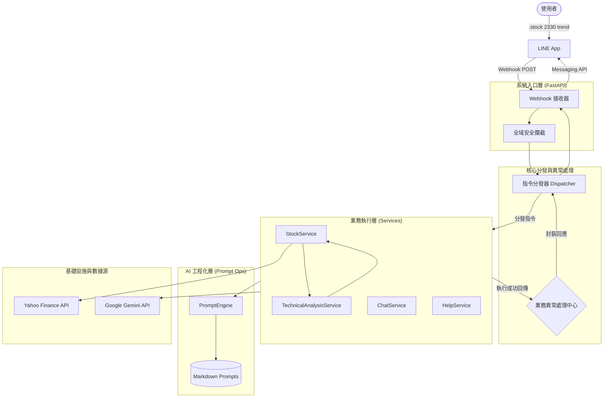

# LineNexus | AI 指令樞紐

本專案是一個基於 LINE 聊天機器人的 AI 多功能助手。採用指令式 (Command-based) 架構與 Clean Architecture 概念，使用者可以透過特定指令進行技術分析、數據查詢與 AI 互動。

---

## 系統核心架構

本專案採用 Dispatcher (分發器) 與 Service (服務層) 模式，並透過 PromptEngine 實現 AI 提示詞的工程化管理。系統具備數據富集 (Data Enrichment) 能力，在 AI 分析前會先進行精確的技術指標運算。



### 架構特色

*   **數據富集 (Data Enrichment)**: 在將數據餵給 LLM 之前，先透過 Python 計算精確的技術指標 (MA, RSI, MACD 等)，避免 AI 運算錯誤。
*   **多流派分析策略**: 支援透過指令選擇不同的分析流派 (如趨勢流、動能流)，動態調整 Prompt 渲染邏輯。
*   **Prompt 工程化管理 (Prompt as Code)**:
    *   提示詞與程式碼解耦，支援 Jinja2 模板渲染。
    *   透過 YAML Frontmatter 實作版本管理與元數據追蹤。
*   **雙層異常處理**:
    *   系統層 (FastAPI): 攔截 HTTP 層級錯誤。
    *   業務層 (Dispatcher): 捕捉業務邏輯異常，回傳標準化友善提示。

---

## 技術棧 (Technology Stack)

*   **Runtime**: Python 3.12 (建議版本，以確保與 numba/pandas-ta 相容)
*   **Web Framework**: FastAPI
*   **Data Analysis**: Pandas, Pandas-TA
*   **AI Service**: Google Gemini API
*   **Prompt Engine**: Jinja2 + PyYAML
*   **Package Manager**: uv
*   **Logging**: Loguru (支援 Request ID 追蹤)
*   **Testing**: Pytest

---

## 環境設置

1.  **環境管理**
    本專案使用 uv 進行管理。
    ```bash
    uv venv --python 3.12
    uv sync
    ```

2.  **設定環境變數**
    複製 .env.example 並填入金鑰：
    ```ini
    LINE_CHANNEL_ACCESS_TOKEN="YOUR_TOKEN"
    LINE_CHANNEL_SECRET="YOUR_SECRET"
    GEMINI_API_KEY="YOUR_KEY"
    ```

---

## 品質保證 (QA)

*   **執行測試**
    ```bash
    uv run pytest
    ```
*   **程式碼檢查 (Lint)**
    ```bash
    uv run lint
    ```
*   **型別檢查 (Type Check)**
    ```bash
    uv run type-check
    ```

---

## 指令互動

| 指令 | 說明 | 範例 |
| :--- | :--- | :--- |
| `.stock [代碼] [流派]` | AI 技術分析 (流派可選: trend, momentum, general) | `.stock 2330 trend` |
| `.price [代碼]` | 快速查詢即時報價 (純數據) | `.price 2330` |
| `.chat [訊息]` | AI 一般性對話 | `.chat 你好` |
| `.help` | 顯示功能說明 | `.help` |

## 授權

本專案採用 MIT 授權。
