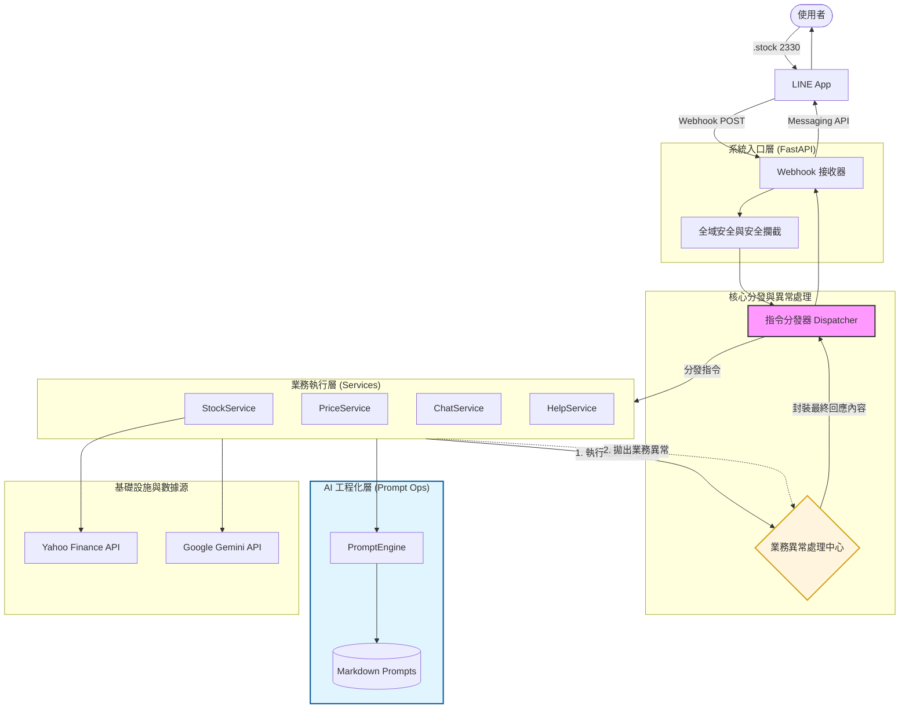

# LineNexus | AI 指令樞紐

本專案是一個基於 LINE 聊天機器人的 AI 多功能助手。採用指令式 (Command-based) 架構與 **Clean Architecture** 概念，使用者可以透過特定指令進行台股分析、AI 聊天或其他擴展功能。

---

## 🚀 專案核心架構

本專案引入 **Dispatcher (分發器)** 與 **Service (服務層)** 模式，並透過 **PromptEngine** 實現 AI 提示詞的工程化管理，確保功能模組化且易於測試與擴展。



### 架構特色

*   **指令分發器 (Dispatcher)**: 負責解析指令標籤，並統一處理業務異常 (Business Logic Exceptions)。
*   **Prompt 工程化管理 (Prompt as Code)**:
    *   將 AI 提示詞與程式碼解耦，儲存於外部 `.md` 檔案。
    *   支援 **Jinja2** 模板渲染，動態注入業務數據。
    *   透過 **YAML Frontmatter** 實作提示詞版本管理與元數據追蹤。
*   **服務層 (Services)**: 每個功能模組獨立運作，強制實作 `BaseService` 介面。
*   **雙層異常處理**:
    *   **系統層 (FastAPI)**: 攔截 500/400 錯誤，確保 HTTP 狀態碼正確。
    *   **業務層 (Dispatcher)**: 攔截邏輯錯誤，回傳友善的 `⚠️` 或 `❌` 提示。

---

## 🛠️ 技術棧 (Technology Stack)

*   **Runtime**: Python 3.12+
*   **Web Framework**: FastAPI
*   **AI Service**: Google Gemini API
*   **Prompt Engine**: Jinja2 + PyYAML (Frontmatter 解析)
*   **Package Manager**: `uv` (高效能替代 pip/poetry)
*   **Static Analysis**: `ruff` (Linter/Formatter), `mypy` (Static Type Checker)
*   **Logging**: `loguru`
*   **Testing**: `pytest`

---

## 📦 環境設置

1.  **環境管理**
    本專案使用 `uv` 進行管理，請確保已安裝 `uv`。
    ```bash
    uv venv
    uv sync
    ```

2.  **設定環境變數**
    複製 `.env.example` 並填入金鑰：
    ```ini
    LINE_CHANNEL_ACCESS_TOKEN="YOUR_TOKEN"
    LINE_CHANNEL_SECRET="YOUR_SECRET"
    GEMINI_API_KEY="YOUR_KEY"
    ```

---

## 🧪 品質保證 (QA)

我們堅持 **測試與開發並行 (DoD)** 的原則。

*   **執行所有測試**
    ```bash
    uv run pytest
    ```
*   **程式碼風格檢查 (Lint)**
    ```bash
    uv run ruff check .
    ```
*   **靜態型別檢查 (Type Check)**
    ```bash
    uv run mypy .
    ```

---

## 📁 專案結構 (Project Structure)

```bash
LineAiHelper/
├── src/lineaihelper/
│   ├── main.py             # 進入點
│   ├── dispatcher.py       # 指令分發器
│   ├── prompt_engine.py    # Prompt 渲染引擎
│   ├── prompts/            # [NEW] 提示詞倉庫 (Markdown)
│   │   ├── stock/latest.md
│   │   └── chat/latest.md
│   ├── models/             # 領域模型
│   ├── providers/          # 外部資料提供者
│   ├── services/           # 業務服務層
│   └── config.py           # 配置管理
├── tests/                  # 測試架構
├── mypy.ini                # Mypy 設定
├── ruff.toml               # Ruff 設定
└── pyproject.toml          # 依賴管理
```

## ⌨️ 指令互動

| 指令 | 說明 | 範例 |
| :--- | :--- | :--- |
| `.stock [代碼]` | 結合多週期數據的 AI 技術分析 | `.stock 2330` |
| `.price [代碼]` | 快速查詢即時報價 (純數據) | `.price 2330` |
| `.chat [訊息]` | AI 一般性對話 (具備 System Prompt) | `.chat 你是誰？` |
| `.help` | 顯示指令列表 | `.help` |

## 授權

本專案採用 MIT 授權。