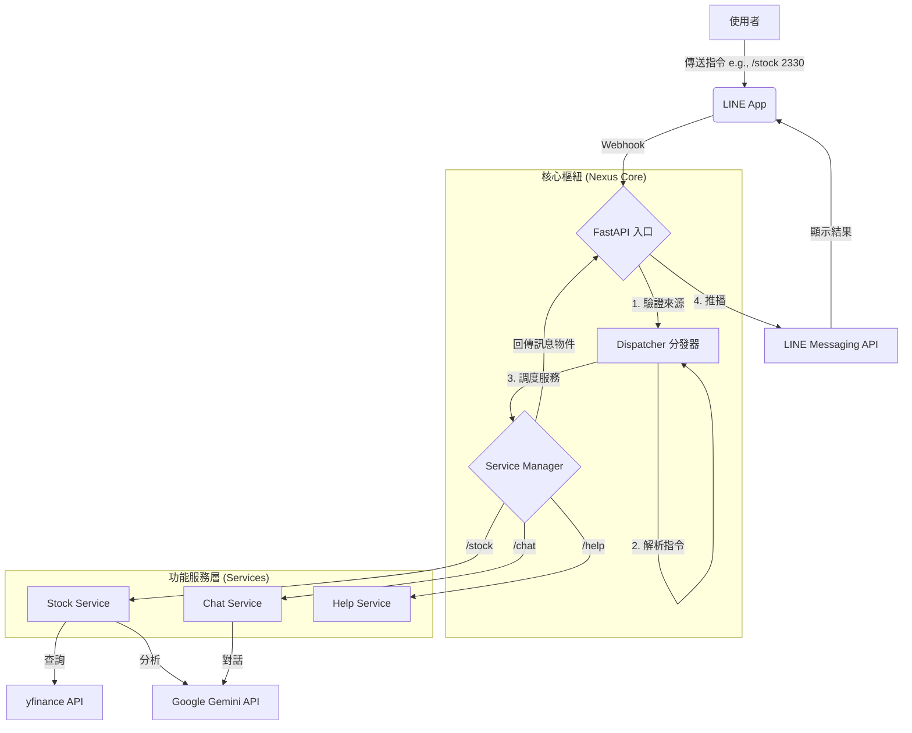

# 軟體設計文件 (Software Design Document) - LineNexus

**版本**: 1.1.0
**日期**: 2025-01-25
**專案名稱**: LineNexus | AI 指令樞紐

---

## 1. 簡介

### 1.1. 文件目的
本文件詳述「LineNexus」系統的架構設計、技術選型與開發指南。其目標是建立一個具備高度擴展性的 LINE 指令機器人平台，作為未來新增 AI 功能（如股市、天氣、翻譯等）的技術藍圖。

### 1.2. 專案概述
LineNexus 是一個基於 LINE 的 **指令式 AI 代理 (Command-based AI Agent)**。核心採用「分發器 (Dispatcher)」模式，能解析使用者輸入的特定指令（如 `/stock`, `/chat`），並將請求派發至獨立的功能模組（Services）。本系統整合了 Google Gemini LLM 以提供核心的理解與生成能力。

### 1.3. 專案範疇

#### 1.3.1. 範圍內 (In-Scope)
*   **指令分發系統**: 建立核心 Dispatcher，支援 `/` 指令解析。
*   **股市分析服務**: 整合 `yfinance` 與 Gemini，提供專業的台股投資見解。
*   **AI 聊天服務**: 提供基於 Gemini 的一般性對話功能。
*   **模組化架構**: 透過 Service 模式讓新功能能以「外掛」方式加入。
*   **非同步架構**: 使用 FastAPI 與非同步 IO 處理高併發 Webhook 請求。

#### 1.3.2. 範圍外 (Out-of-Scope)
*   **複雜圖表繪製**: 初期僅回傳文字分析，不提供動態圖片生成。
*   **即時串流報價**: 股市數據採用 Yahoo Finance 延遲數據。
*   **支付系統整合**: 本系統不涉及任何交易或收費行為。

---

## 2. 系統架構

### 2.1. 高階架構圖
系統採用「中心化分發，去中心化執行」的架構模式。



### 2.2. 核心組件說明
1.  **FastAPI Entry (main.py)**: 負責 HTTP 通訊、簽章驗證與初步的事件分流。
2.  **Dispatcher (dispatcher.py)**: 系統的大腦。負責字符串解析，識別指令標籤與參數，並決定由哪個 Service 處理。
3.  **Service Layer (services/)**:
    *   **BaseService**: 定義所有服務必須實作的介面（抽象類別）。
    *   **StockService**: 封裝股市數據獲取與 AI 提示詞工程。
    *   **ChatService**: 封裝與 Gemini 的直接對話邏輯。
4.  **External Adaptors**: 封裝對外部 API (Line, Gemini, Yahoo) 的低階呼叫。

---

## 3. 詳細設計

### 3.1. 指令解析邏輯 (Command Parsing)
Dispatcher 採用簡單而嚴謹的解析規則：
*   **語法**: `/[指令名] [參數1] [參數2]...`
*   **範例**: `/stock 2330` -> 指令: `stock`, 參數: `['2330']`
*   **容錯**: 若使用者輸入不帶 `/` 的文字，預設導向 `ChatService` 或回傳指令提示。

### 3.2. 服務介面設計 (Service Interface)
為了保證擴展性，所有服務繼承自 `BaseService`：
```python
class BaseService(ABC):
    @abstractmethod
    async def handle(self, user_id: str, args: List[str]) -> str:
        """處理請求並回傳文字結果"""
        pass
```

### 3.3. API 端點設計
*   **`POST /callback`**: 唯一的 Webhook 入口。
    *   驗證 `X-Line-Signature`。
    *   僅處理 `MessageEvent` 且類型為 `TextMessage` 的事件。
    *   回應碼始終為 `200 OK`，處理失敗則回傳錯誤訊息給使用者。

---

## 4. 資料庫設計 (Persistence)

採用 PostgreSQL 儲存長期數據，透過 SQLAlchemy 管理。

### 4.1. 查詢紀錄表 (query_logs)
| 欄位 | 型別 | 說明 |
| :--- | :--- | :--- |
| `id` | BigInt (PK) | 唯一識別碼 |
| `user_id` | String | LINE 使用者識別碼 |
| `command` | String | 觸發的指令類型 (e.g., stock) |
| `raw_text` | Text | 使用者原始輸入內容 |
| `response` | Text | AI 回傳的結果內容 |
| `created_at` | Timestamp | 請求時間 |

---

## 5. 錯誤處理與日誌

### 5.1. 日誌策略 (Loguru)
*   **格式**: `[時間] [等級] [模組] - 訊息`
*   **輪換**: 每日輪換，保留 10 天，舊檔壓縮。
*   **關鍵紀錄點**:
    *   Webhook 接收與簽章驗證結果。
    *   指令解析後的路由目標。
    *   外部 API (Gemini/Yahoo) 呼叫成功與否及延遲時間。

### 5.2. 異常回饋
*   **未知指令**: 回傳「收到的指令無效，請輸入 /help 查看說明」。
*   **服務逾時**: 回傳「AI 目前忙碌中，請稍後再試」。
*   **無效參數**: 回傳「股票代碼格式錯誤 (範例: /stock 2330)」。

---

## 6. 技術棧 (Technology Stack)
*   **核心**: Python 3.14+
*   **框架**: FastAPI (ASGI)
*   **AI**: Google Generative AI (Gemini 1.5/2.0)
*   **數據**: yfinance (Yahoo Finance)
*   **通訊**: line-bot-sdk-python
*   **管理**: uv (Package & Env Manager)
*   **伺服器**: Uvicorn ( ASGI Server)

---

## 7. 未來擴展藍圖 (Roadmap)
1.  **多樣化指令**: 預計新增 `/weather`, `/translate`, `/news`。
2.  **上下文記憶**: 透過資料庫儲存近期對話，讓 `/chat` 具備多輪對話能力。
3.  **富媒體回覆**: 支援回傳 Line Flex Message 以提供更美觀的股市報價面板。
4.  **背景任務**: 使用 `BackgroundTasks` 處理超長分析，避免 LINE Webhook 5 秒超時限制。